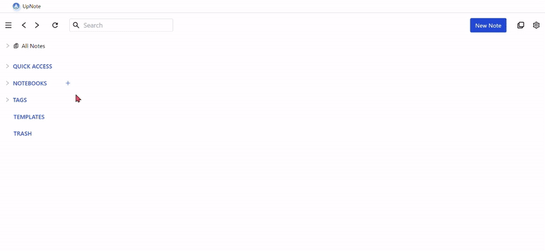

# UpNote_CloneCoding
<br>

## 🖥️구현 화면
<br>




## ⚙️ Stack

<br>

  
 


   

<br>

## 실행 방법

#### 1. 레포지토리 클론

```bash
git clone https://github.com/jelly12paw/UpNote_CloneCoding.git
```

#### 2. 폴더 이동

```bash
    cd upnote
```

#### 3. 패키지 설치

```bash
    yarn install
```

##### npm 설치 시 **.yarn**, **yarn.lock**, **.yarnrc.yml** 폴더 삭제 후 진행
```bash
    npm install
```

#### 4. 실행하기

```bash
    yarn start
```

```bash
    npm start
```

<br>

## 실제 구현 기능

#### NOTEBOOKS의 목록 기능 구현

#### NOTEBOOKS의 추가 및 삭제 기능 구현

#### NOTEBOOKS를 선택 후, 해당 NOTEBOOKS 내 메모 목록 기능 구현

#### 메모 목록에서 메모를 선택해여 메모 내용 확인 기능 구현

#### 텍스트 편집기 ‘lexical text editor’ 이용

#### 메모 목록에서 메모 내용의 첫번째 줄이 메모의 제목으로 표시

#### 메모의 제목이 메모 목록의 가로 길이를 넘어가는 경우, 말줄임표(...) 처리

<br>

## 구현하지 못한 기능

#### 텍스트 입력 후 즉시 혹은 일정 시간 후 입력 사항 저장 기능

#### 메모 내용 수정 기능
